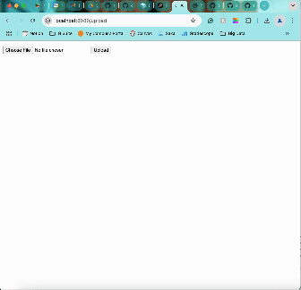

# Flask on Docker

## Overview
This repository follows this tutorial: https://testdriven.io/blog/dockerizing-flask-with-postgres-gunicorn-and-nginx/

This repo contains a Flask-based web application that allows users to upload and serve media images. This application is containerized using Docker and organized with Docker Compose, with Nginx handling static and media file requests in production. Users can upload images through a simple web interface and access them through the media endpoint.



## Build Instructions
### Development Setup
1) Create the necessary environment files by renaming *.env.dev.example* to *.env.dev*.
2) Build the images and run the containers:
```
$ docker compose up -d --build
```
* This command builds the necessary Docker images and starts the containers in detached mode.

3) Test this out at http://localhost:8080.
  * This sends the files to the Flask application, which accesses it and outputs the request.
5) Shut down the containers when finished:
```
$ docker compose down -v
```
* This stops the running containers and removes volumes to free up storage.

### Production Setup
1) Create the necessary environment files by renaming *.env.prod.db.example* to *.env.prod.db*.
2) Start the production containers:
```
$ docker compose -f docker-compose.prod.yml up -d --build
```
* This builds and runs the production containers using Gunicorn and Nginx.
4) Initialize the database:
```
$ docker compose -f docker-compose.prod.yml exec web python manage.py create_db
```
* This creates the necessary database schema for the application.
6) Test this out at http://localhost:8080.
* Nginx serves the file in production.
7) Shut down the containers when finished:
```
$ docker-compose down -v
```
* This removes the production containers and volumes.
